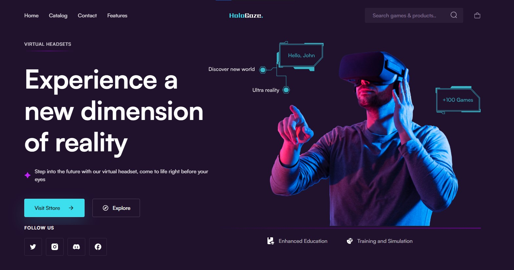
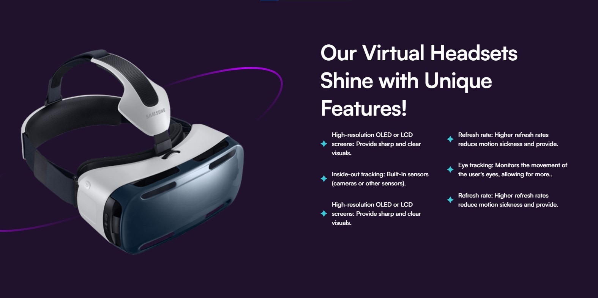
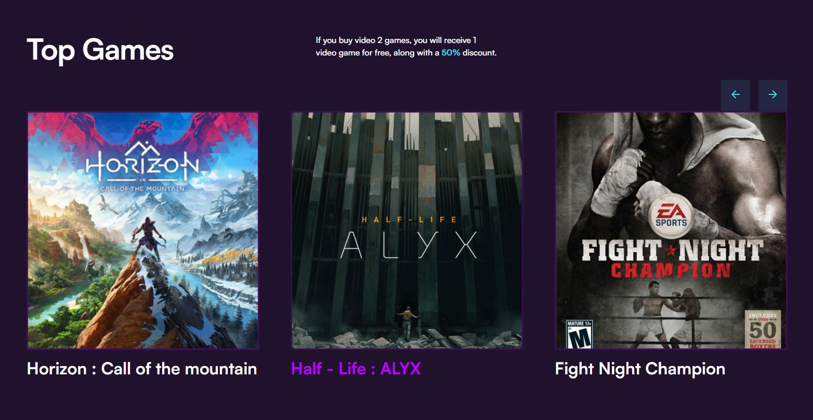

# Virtual Headset Landing Page

"Virtual Headset Landing Page" is a React project that brings the captivating design from Figma to life. This responsive and interactive webpage showcases virtual reality headsets with smooth animations.
It provides a modern, user-friendly experience for desktop and mobile users.

## Technologies Used

- HTML5
- CSS3
- JavaScript
- React + Vite

## Credits

- Figma Design: The design for this landing page is based on the work by [Giorgi Matsukatovi](https://www.figma.com/community/file/1285212925882558712).

## Live View
- [https://terrytim.github.io/virtual-headset-landing-page/](https://terrytim.github.io/virtual-headset-landing-page/)

---

